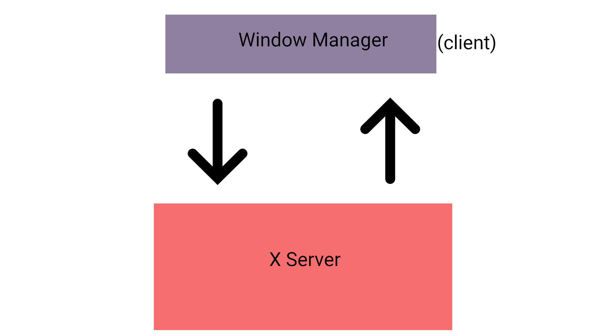

# Building an X11 window manager in C (part 1): setting things up

## Foreword

The following is a multi-part series on building a **dynamic tiling**
window manager in C. A quick peek at what we are about to build:

Features include:

1. Cool Fibonacci tiling layout(like bspwm)
2. Virtual workspaces(more like tags in dwm)
3. Mouse support(focus, resize & move windows)
4. Full screen toggle
5. Respect window state(example: watching a YouTube video will
   automatically toggle full screen)

And much more.....

All the source code is available on
[github](https://github.com/Murtaza-Udaipurwala/window_manager_in_c),
wherein each part is divided into it's own separate branch.

## Prerequisites
The reader is assumed to have the following knowledge,

1. C programming language(pointers, arrays, loops, conditionals)
2. Basic operations on a singly linked list(insertion, deletion,
   searching)
3. [sxhkd](https://github.com/baskerville/sxhkd) program to bind keys
   (resource: [link](https://www.youtube.com/watch?v=2ClckQzJTlk))

## Introduction

A window manager is one of the core components of a Linux/BSD desktop.
It is a program that tells the X server how and where a window must be
placed. It is the window manager that defines our day-to-day user
experience to a large degree.

## Client-server architecture

X operates in a client-server architecture. Our window manager is simply
a client that can talk to the X server. The X server allows us to call a
set of special API(Application Programming Interface), using which we
can control how and where a window must be placed on the screen.


## Setting things up

Enough talking, lets write some code.

Lets start by including some libraries

```c
#include <X11/Xlib.h>
#include <stdio.h>
#include <stdlib.h>
```

The `Xlib.h` is the header file that provides those API calls we talked
about. I'll assume you know about the other 2 includes.

Next, lets define a basic structure of our window manager

```c
Display *dpy;

void start();
void grab();
void loop();
void stop();
void die();

int main() {
    start();
    grab();
    loop();
    stop();
    return 0;
}
```

```c
Display *dpy;
```

`dpy` is a reference to the `Display` interface. Don't worry about this
right now. Pretty much all the API calls require `dpy` as their first
parameter. It is a way to describe the connection with the X server.

`die` is a helper function which exits our program in case of a fatal
error

```c
void die(char *exit_msg) {
    fprintf(stderr, "%s\n", exit_msg); /* write a debug MSG before exiting */
    exit(EXIT_FAILURE);
}
```

```c
void start();
```

The `start()` function contains code to initialise our window manager.
This includes opening a connection to the X server, cleaning up zombie
processes, defining the root window, setting up some defaults, etc.

For now we'll just open a display:

```c
void start() {
    if (!(dpy = XOpenDisplay(0))) /* this will get more clear in the future */
        die("failed to open display");
}
```

`grab()` function will contain necessary code to tell the X server to
grab user input like key presses, cursor movements, or mouse button
clicks. We'll go over this in the next tutorial.

Our `loop()` method contains an infinite loop which listens to events
(sent by the X server) and handles them accordingly. Since we haven't
covered events yet, `loop` method will simply contain an infinite
`while` loop for now.

```c
void loop() {
    while(1);
}
```

Finally the `stop` method. This method is used to clean up resources,
close down all open windows(applications) and shutdown our connection
with the X server. For now it only closes the connection.

```c
void stop() {
    XCloseDisplay(dpy);
}
```

## Compiling

```bash
$ gcc wm.c -o wm -lX11 # -lX11 flag is used to link the necessary X11 files
$ sudo mv wm /usr/local/bin
```

In your `xinitrc`(if using startx)

```bash
sxhkd &
exec wm
```

Note: If you are using a login manager, I recommend you disable it and
simply use `startx` to start the display server. Since programming a
window manager requires restarting X server(xorg) to test new changes,
`startx` proves to be faster.

## sxhkd

In my sxhkdrc, `super + return` is bound to bring up a terminal window.

```bash
super + Return
    $TERMINAL
```

## Result

Restart the X server. On pressing `super + return`, terminal window
appears on the top left corner of the screen(this is the default
behaviour).

To exit out of our window manager,

```bash
$ pkill -9 wm
```


## Conclusion

Good job 👍, you have successfully completed part I of this tutorial
series. Next tutorial will be released on 6th March where we will cover
`events`. If you have any doubts, feel free to contact me.

If you want to learn more about a particular Xlib function, remember
`man` is your best friend. Example:

```bash
$ man XOpenDisplay
```

## Links

1. [sxhkd](https://www.youtube.com/watch?v=2ClckQzJTlk)
2. [linked list](https://www.youtube.com/watch?v=Hj_rA0dhr2I)
3. [startx](https://www.youtube.com/watch?v=dtuy09mqBPI)
