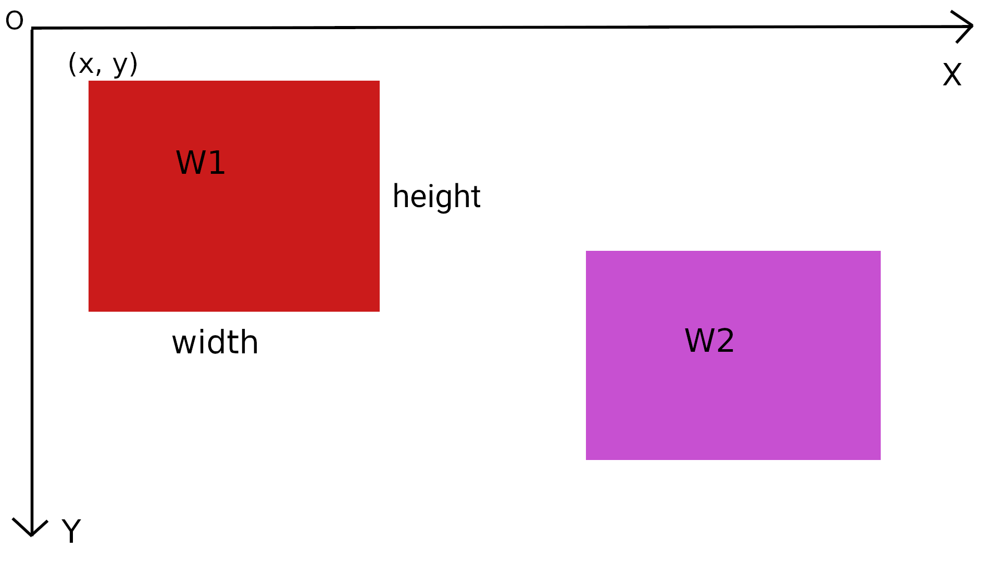
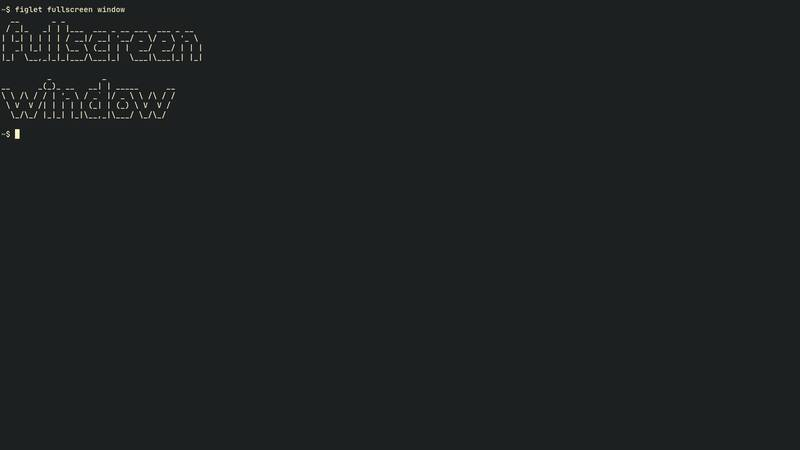

# Building an X11 window manager in C (part 2): Events

## Introduction

An `event` is a method by which the X server notifies the client about
the occurrence of "something". "Something" may involve,

* Mapping/Unmapping of a window
* Destroying a window
* A Window requesting a change in state, etc..

Building an X11 window manager is all about handling specific events. In
today's tutorial we'll learn about handling the `XMapRequest` event.

## Screen

Before learning about how to handle `events`, we need to setup some
basic things.

`Screen` is the term used by many X applications including `xrandr`.
Each of your monitor is equal to one `screen`. In order to get the
default screen(monitor), one may call the `DefaultScreen` method.

```c
int screen;

screen = DefaultScreen(dpy);
```

## Co-ordinates(location) of a window



* The top right corner is the origin(O) of the co-ordinate axes.
* `x` co-ordinate increases as we move from left to right.
* `y` co-ordinate increases as we move from top to bottom.
* When asked about the location of a window on the screen, you are meant
  to provide,

    1. `x` and `y` co-ordinate of the top-left corner of the window.
    2. `width` of the window.
    3. `height` of the window.

* From now onwards, whenever I say `x` & `y`, I implicitly mean the
  co-ordinates of the top-left corner of a window.

## The root window

* The `root` window is a hypothetical concepts defined in order to
  understand windowing system.
* For `root` window,

    ```c
    x = 0
    y = 0
    width = width of the monitor(screen)
    height = height of the monitor(screen)
    ```

* All windows are spawned on top of the `root` window.

```c
struct Root {
    Window win;
    int x, y;
    unsigned int width, height;
    unsigned int layout;
} root;

root.win = XDefaultRootWindow(dpy);
root.width = XDisplayWidth(dpy, screen);
root.height = XDisplayHeight(dpy, screen);
```

* Above I have defined a `struct` that will hold all the information
  related to our `root` window.
* `XDefaultRootWindow` returns the root window object. Like most other
  `Xlib` functions, this one takes `dpy` as the first argument.
* Next we have the `XDisplayWidth` and `XDisplayHeight` functions. The
  2nd argument over here is the `screen` whose width and height needs to
  be returned.

## Event handlers

All handlers must take in `XEvent` as an argument. `XEvent` is a generic
X event structures.

```c
void maprequest(XEvent *event);
```

All events in `Xlib` are defined by a unique integer. Example:

```c
#define MapRequest      20
#define KeyPress        2
#define KeyRelease      3
#define ButtonPress     4
#define ButtonRelease   5
#define DestroyNotify   17
```

The event handlers are organized in an array and are accessed whenever a
new event has been fetched by the `loop` function. This allows event
dispatching in O(1) time.

```c
void (*handle_events[LASTEvent])(XEvent *event) = {
    [MapRequest] = maprequest,
};
```

`LASTEvent` is the total no. of possible events, provided by the
`XServer`.

If the above syntax is unknown to you, please refer to this simple
example:
[here](https://gist.github.com/Murtaza-Udaipurwala/fea3611b7ddb8a378223364f9cf5c726)

The above code can also be written using `switch-case`. However using
`switch`, does not provide the benefit of event dispatching in O(1)
time. See the `loop()` function below to understand better.


## Map request event

```c
void maprequest(XEvent *event) {
    XMapRequestEvent *ev = &event -> xmaprequest;
    XMoveResizeWindow(dpy, ev -> window, 0, 0, root.width, root.height);
    XMapWindow(dpy, ev -> window);
}
```

Lets go over each line one by one.

```c
XMapRequestEvent *ev = &event -> xmaprequest;
```

`XMapRequestEvent` is the Map Request event structure. We are getting
the specialised Map Request event structure from the generic event
structure.

```c
XMoveResizeWindow(dpy, ev -> window, 0, 0, root.width, root.height);
```

Here we are calling `XMoveResizeWindow` function. This function allows
us to move and resize a window. This function takes in,

* `window` which needs to be moved.
* New `x` co-ordinate of the top-left corner of the window.
* New `y` co-ordinate of the top-left corner of the window.
* New `width` of the window.
* New `height` of the window.

Hence, the above line essentially makes a window go full screen.

```c
XMapWindow(dpy, ev -> window);
```

This function maps(displays) the window to screen. His brother is
`XUnmapWindow`, which unmaps(hides) the window from the screen.

## Receiving events from the X Server

```c
void loop() {
    XEvent ev;

    while (!XNextEvent(dpy, &ev)) {
        /* handle only those events for which we have handlers defined */
        if (handle_events[ev.type]) {
            handle_events[ev.type](&ev);
        }
    }
}
```

`XNextEvent` is a blocking call. This means this code blocks until an
event occurs. In case of an internal error, `XNextEvent` returns `NULL`
and the loop terminates. It takes a pointer to a generic event structure
as an arguments. Information about the event is written to this
variable.

As mentioned earlier, the `XEvent` is a generic event structure.
`ev.type` tells us about the actual event that has occurred. If we have
a handler defined in `handle_events`, we fire up the respective handler.

## Registration of events

Till now we have written all the logic for handling an event. However,
there is one more key to this puzzle. The `XServer` will not notify you
about the `MapRequest` event until and unless you tell it to. The
`XSelectInput` lets you do exactly that.

```c
/* get MapRequest events */
XSelectInput(dpy, root.win, SubstructureRedirectMask);
```

The `SubstructureRedirectMask` is known as the `event mask`. More on
this in the next lecture.

## Putting things together

```c
int screen;

struct Root {
    Window win;
    int x, y;
    unsigned int width, height;
    unsigned int layout;
} root;

/* events */
/* all handlers must take in XEvent as an argument */
void maprequest(XEvent *event);

void (*handle_events[LASTEvent])(XEvent *event) = {
    [MapRequest] = maprequest,
};

void start() {
    if (!(dpy = XOpenDisplay(0))) /* this will get more clear in the future */
        die("failed to open display");

    /* returns the default screen(nothing but an int) */
    screen = DefaultScreen(dpy);

    root.win = XDefaultRootWindow(dpy);
    root.width = XDisplayWidth(dpy, screen);
    root.height = XDisplayHeight(dpy, screen);

    /* get MapRequest events */
    XSelectInput(dpy, root.win, SubstructureRedirectMask);
}

void loop() {
    XEvent ev;

    while (!XNextEvent(dpy, &ev)) {
        /* handle only those events for which we have handlers defined */
        if (handle_events[ev.type]) {
            handle_events[ev.type](&ev);
        }

        /* same code can be written using switch case. However using switch
         * case does not provide the benefit of dispatching the event in O(1)
         * time. */

        /*
        switch(ev.type) {
            case MapRequest:
                maprequest(&ev);
                break;
        }
        */
    }
}

/* fired whenever a new window needs to be mapped(shown) to the screen */
void maprequest(XEvent *event) {
    XMapRequestEvent *ev = &event -> xmaprequest;

    /* To fullscreen a window
     * - Move the origin of the window to (0, 0).
     * - Set width and height of that window equal to root.width and
     *   root.height respectively.
     */
    XMoveResizeWindow(dpy, ev -> window, 0, 0, root.width, root.height);

    XMapWindow(dpy, ev -> window);
}
```

## Result



## Conclusion

In this tutorial we learnt about events and how to handle them. We took
`MapRequestEvent` as example, wherein we maximise newly spawned windows
using the `XMoveResizeWindow` function. In the next tutorial we'll learn
how to move and resize window on the screen using the mouse.

Code: [link](https://github.com/Murtaza-Udaipurwala/window_manager_tutorial/tree/part_2)
